# [MATLAB] Comparison of conventional and intelligent PID controllers in time-delaying environments with load disturbance 

## Introduction
In this project, I compare PID controllers tunned by Z_N method verse Fuzzy PID  and multiobj Genetic algorithm PID in 3 mode: 
- Easy mode: Constant input, no load, no delay. 
- Medium mode: Constant input, load 5s and 20s, delay 1s before 15s and delay 2s afterward
- Hard mode: staircase input, load 5s and 20s, delay 1s before 15s and delay 2s afterward

## What my result show
- Multi-objective Genetic Algorithm optimization for PID seems to be efficient and adaptive for both easy and hard cases.
- While the Ziegler-Nichols tuning method shows better results for easy cases, the Fuzzy_PID approach proves to be superior in hard cases.

## How I build my model: 
* Fuzzy logic: 
    
    I used 3 different fuzzy logic for delta Kp, delta Ki, delta Kd which are fuzzy_delta_Kp.fis, fuzzy_delta_Ki.fis, fuzzy_delta_Kd.fis files in my repository. Each fuzzy logic has 2 input, 1 output and 49 rules based on this [research](https://doi.org/10.1109/PEDES.2012.6484325)
* Multi objective Genetic Algorithm: 
  
  - I use y = ITSE+2*IAE as my 2 fitness functions 

  - Options for multi objective: 

    - MaxGenerations : 200 
    - MaxStallGenerations : 100
    - PopulationSize: 50
    - CrossoverFcn: crossoverheuristic ,crossoversinglepoint, crossovertwopoint
    - CreationFcn: creationuniform
    - MutationFcn: mutationuniform: 
    - SelectionFcn: selectiontournament

## Easy mode: Constant input, no load, no delay.

  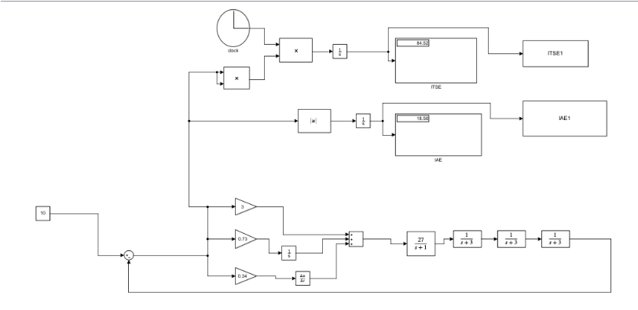 
  <i>Easy_mode PID tunned by Z_N</i>

   
  <i>Easy_mode_fuzzy PID tunned by Z_N</i>

  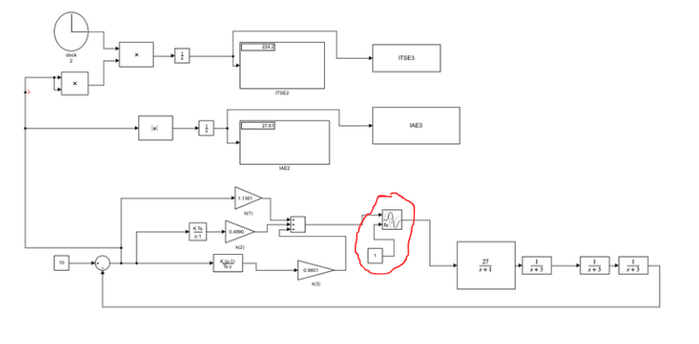 
  <i>Easy mode multi objective GA PID</i>

     *1s delay are required for handle "singulaity error" in Matlab while compute cost function 

### Result

  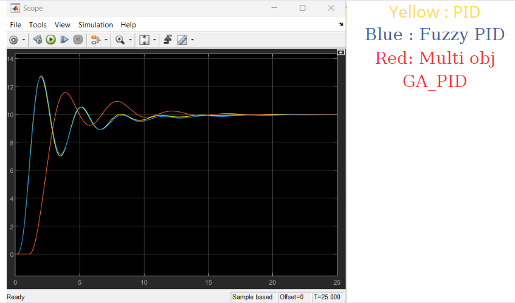 
  <i>Response</i>

  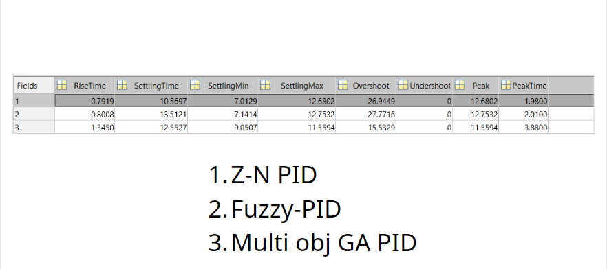 
  <i>Quantitative Result</i>

  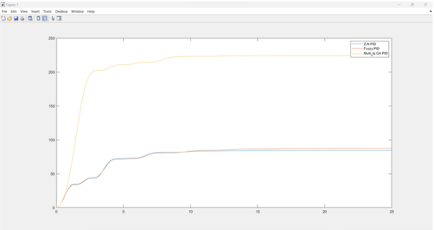 
  <i>Comparison of ITSE</i>

  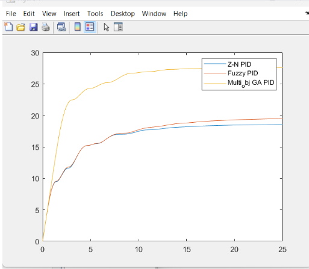 
  <i>Comparison of IAE</i>

## Medium mode: Constant input, load disturbance at 5s and 20s, delay 1s before 15s and delay 2s afterward.

  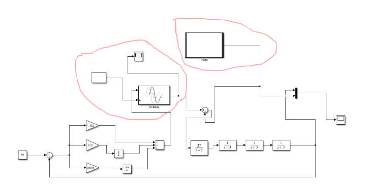 
  <i>medium mode PID with load and delay</i>

  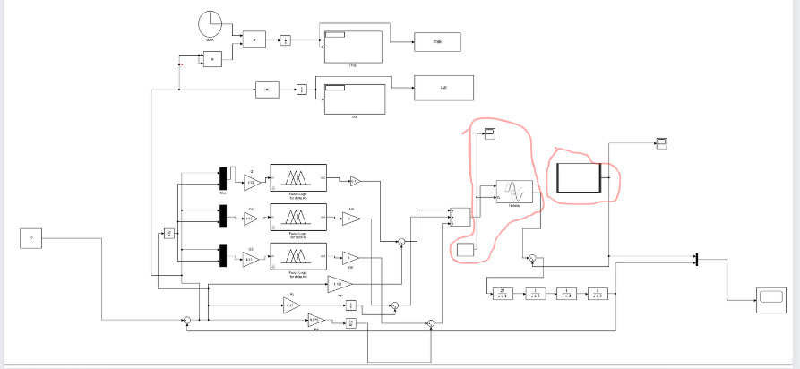 
  <i> medium mode fuzzy PID with load and delay</i>

  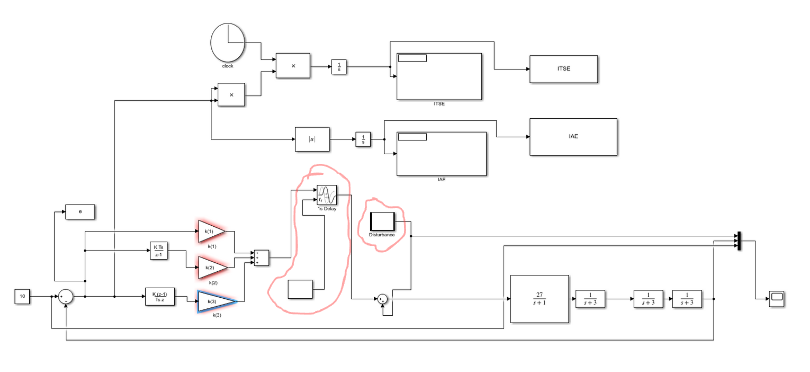 
  <i> medium mode multi objective GA PID with load and delay</i>

### Result

  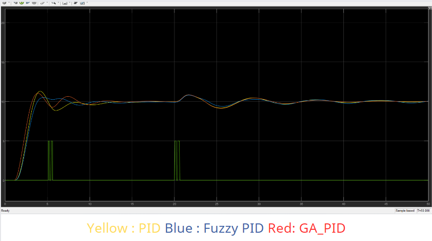 
  <i> Response </i>

  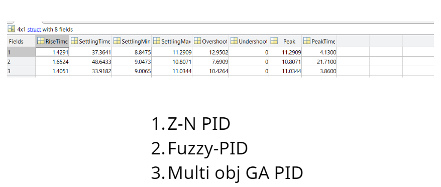 
  <i> Quantitative Result</i>

  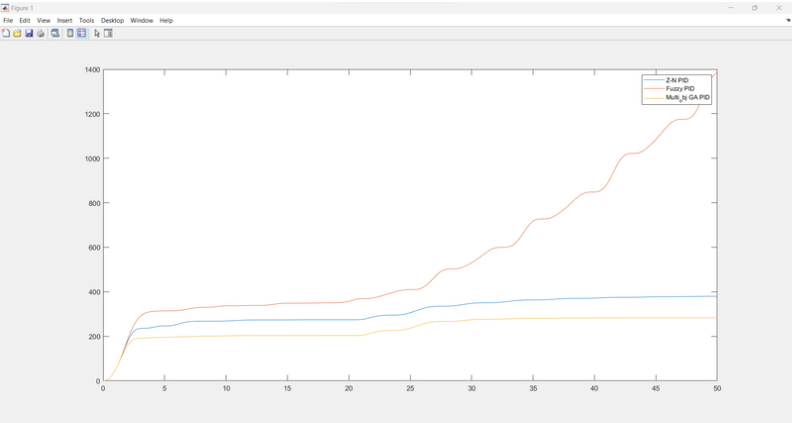 
  <i> Comparision of ITSE </i>

  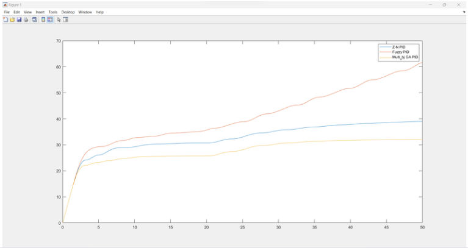 
  <i> Comparision of IAE </i>

## Easy mode: Staircase input, load disturbance at 5s and 20s, delay 1s before 15s and delay 2s afterward. 

  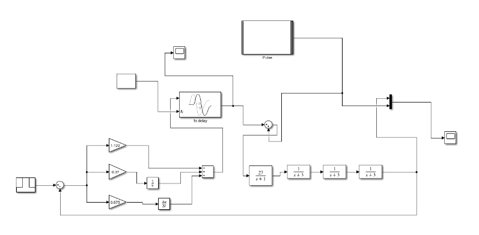 
  <i> Hard mode PID with load and delay </i>

  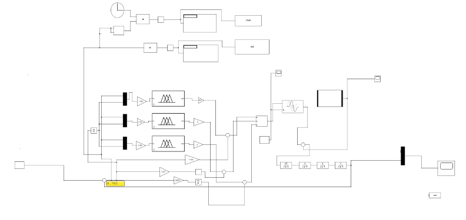 
  <i> Hard mode fuzzy PID with load and delay </i>

  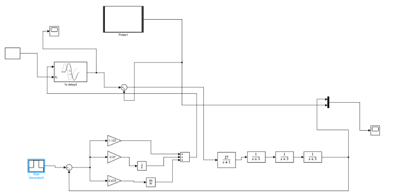 
  <i> Hard mode multi objective GA PID with load and delay </i>

### Result

  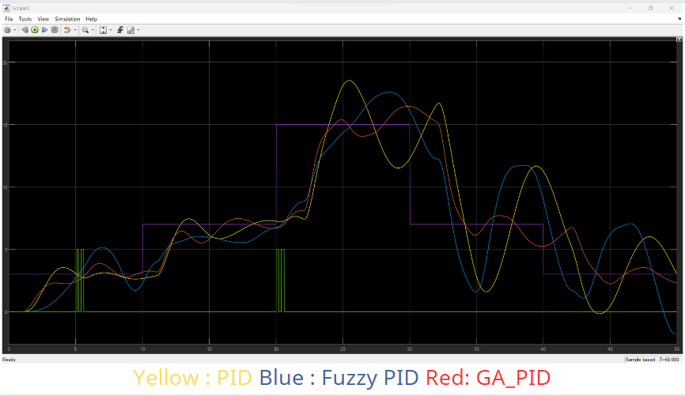 
  <i> Response </i>

  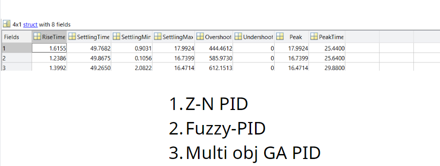 
  <i> Quantiative Result </i>

  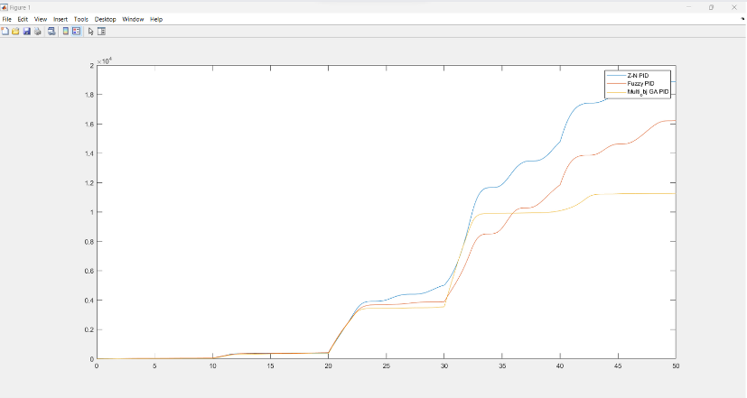 
  <i> Comparision of ITSE </i>

  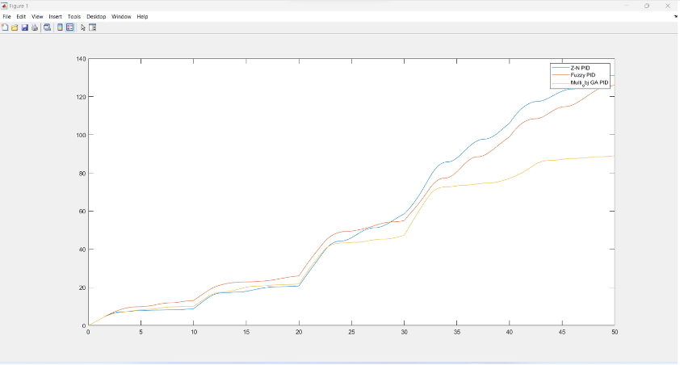 
  <i> Comparison of IAE </i>

